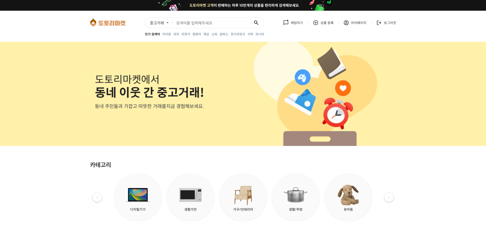
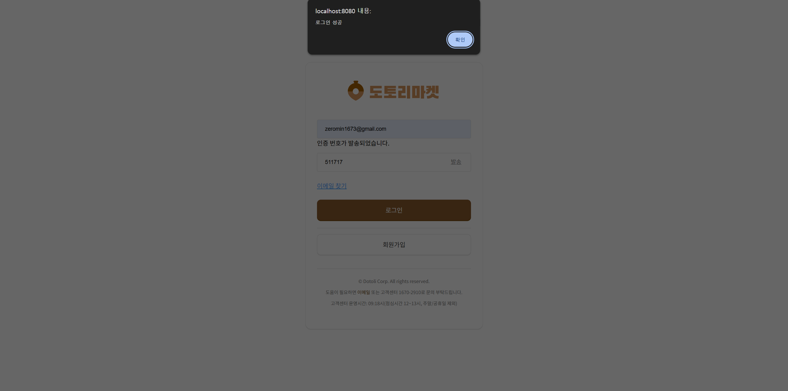
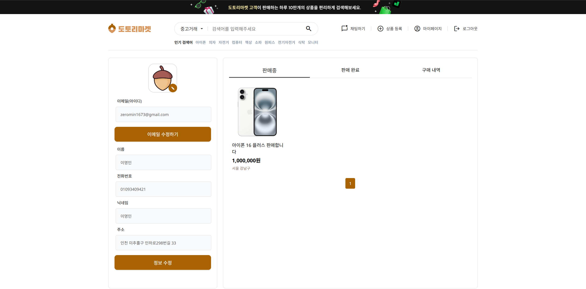
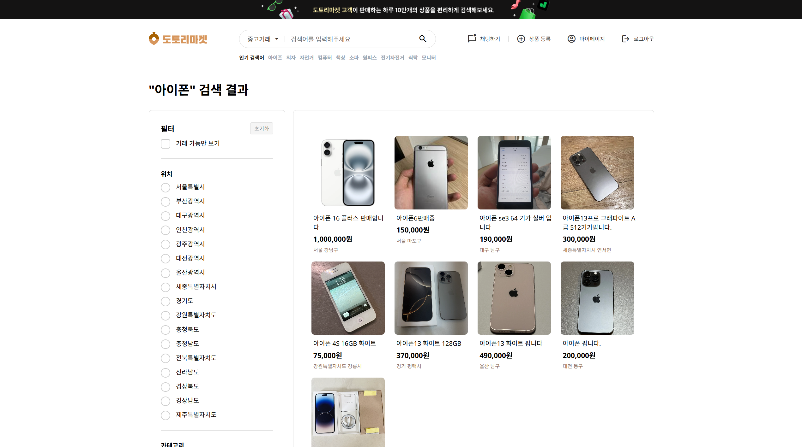
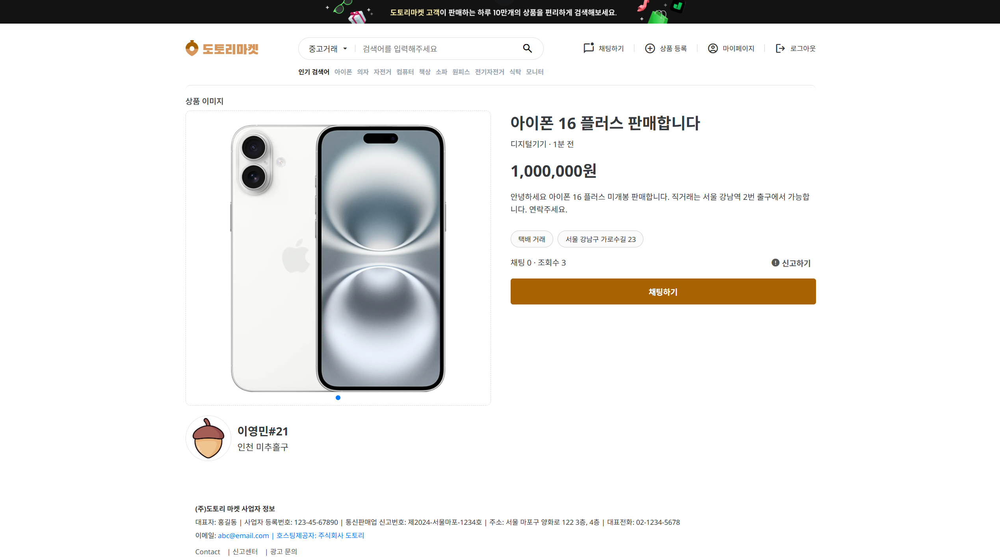

# 도토리

중고거래 시스템 (Spring Legacy + Oracle) 기반 프로젝트.

## 1. 개요
- 목적: 중고거래 서비스 핵심 기능 구현 + 실시간 채팅(WebSocket)
- 핵심 기능: 회원/게시글/거래/채팅/관리자

## 2. 기술 스택
- Backend: Java, Spring (Legacy)
- DB: Oracle
- Front: JSP/HTML/CSS/JS
- 기타 : WebSocket

## 3. Quick Start
### 요구 사항
- JDK: JDK 1.8.0_202
- Maven: Maven 3.9.9 
- Oracle: Oracle Database 21c XE 
- DB 접속 형식: 서비스명(Service Name) 기반의 문자열
- WAS : TOMCAT 9.0

1)  DB 실행 (Oracle 21c  XE)
2) `impdp` 실행
3) `root-context.xml`에서 username/password/URL 확인
4)  STS Run on Server (Tomcat 9.0)
5) `http://localhost:8080/ehr/main.do` 접속

### DB Setup (Recommended: Data Pump Import)
- Local schema/account: `dotori / dotori`  *(local dev only)*  
- DATA_PUMP_DIR는 Oracle DIRECTORY 객체입니다. 실제 OS 경로는 DB에서 확인합니다.  
 예) `SELECT * FROM DBA_DIRECTORIES WHERE DIRECTORY_NAME = 'DATA_PUMP_DIR'; `
- impdp 사용자는 DIRECTORY 객체에 READ/WRITE 권한이 필요할 수 있습니다.
- 경로 예시:  `DATA_PUMP_DIR = C:\app\zerom\product\21c\admin\XE\dpdump\E08902FB317643C2B43AD23D86283F80`

### DMP import 명령어 
```bash
impdp dotori/dotori@//localhost:1521/XEPDB1 DIRECTORY=DATA_PUMP_DIR DUMPFILE=DOTORI_BACKUP.DMP LOGFILE=dp.log \
REMAP_TABLESPACE=DOTORI_TS:USERS
```
- `REMAP_TABLESPACE=DOTORI_TS:USERS`는 원본 테이블스페이스에 속한 객체를 대상 테이블스페이스로 생성하도록 리매핑

## 4. Config(설정 파일 위치)
- DB connection : `root-context.xml`의 `jdbcUrl, username, password`를 프로퍼티로 가진   
`dataSource(HikariDataSource)`빈
- Email SMTP : `root-context.xml`의 `host, port,  username, password`를 프로퍼티로 가진  
 `mailSenderImpl(JavaMailSenderImpl)`빈

## 5. Demo Screenshots

### 메인 


### 로그인 


### 마이페이지


### 상품 검색 


### 상품 상세 페이지 


### 채팅


## 6. Troubleshooting
### ORA-00959: tablespace does not exist (DOTORI_TS)
- Cause: local DB lacks original tablespace
- Fix: `REMAP_TABLESPACE=DOTORI_TS:USERS`

### CWE-798(하드코딩 크리덴셜) Issue
- Cause: 설정 파일에 계정/비밀번호가 평문으로 하드코딩 된 채 깃허브 공개 저장소에 커밋되어 있음.
- Fix: 민감정보(DB/SMTP)는 properties로 외부화했고, 실제 값 파일은 커밋하지 않음. 또한 템플릿 파일을 복사해 로컬 설정을 구성